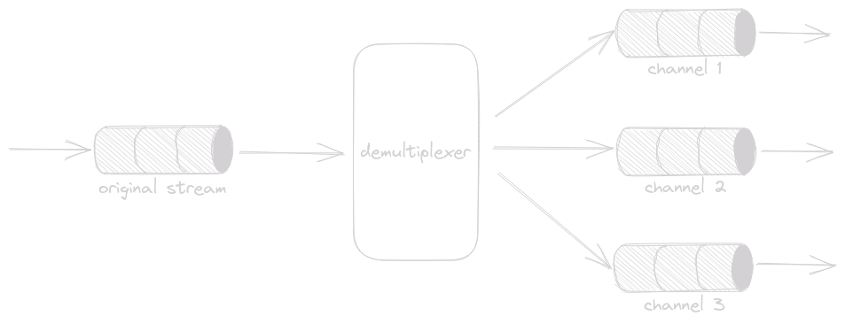
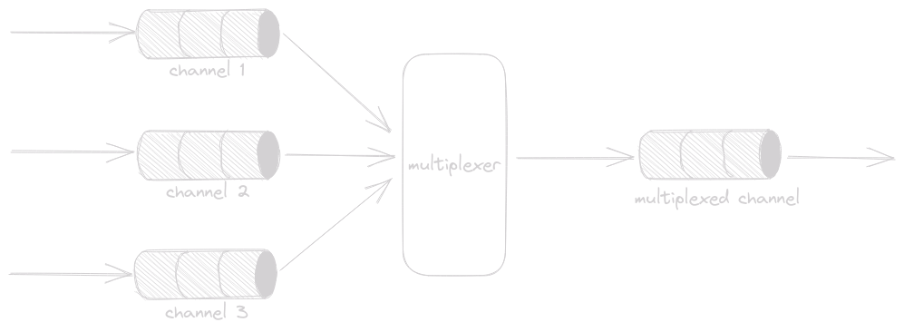

## Fan Out Pattern

Takes a single data stream and creates several concurrent streams. The application for this pattern is when you want to concurrently process a data stream and you do not need your data to be processed in order.

Code Example [here](./fan_out.go)

## Fan In Pattern

Code Example [here](./fan_in.go)
